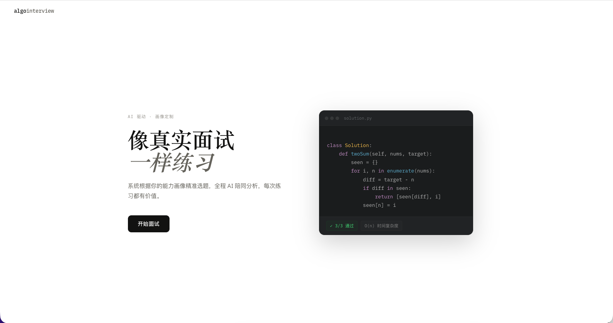
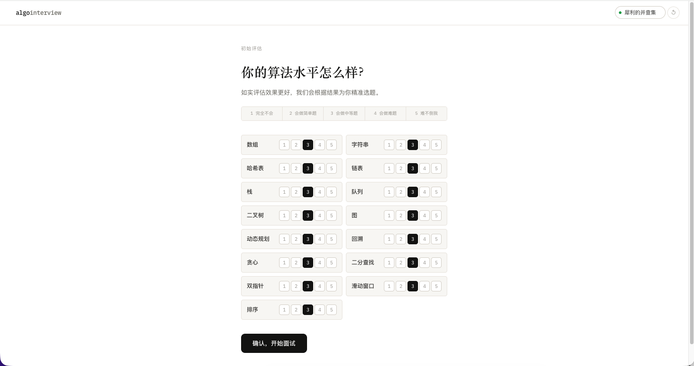
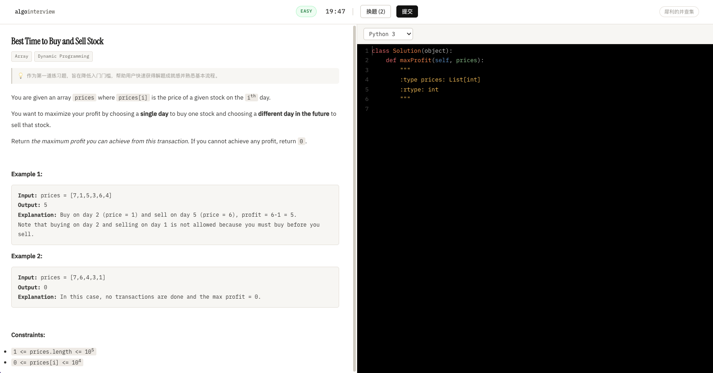
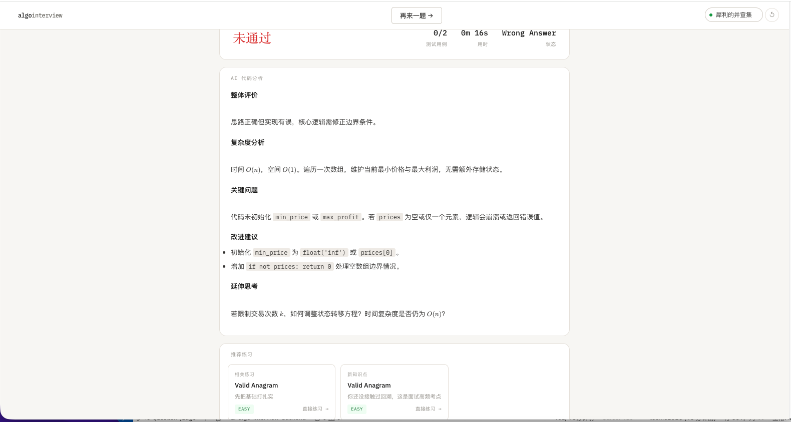
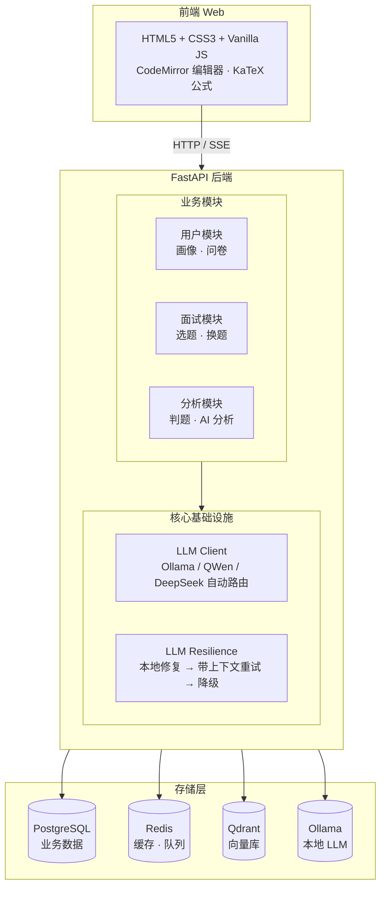
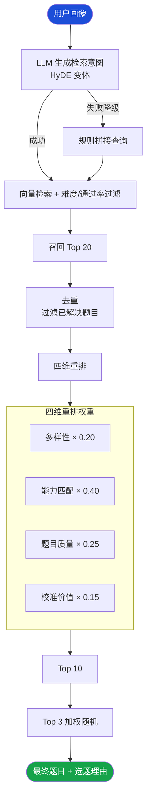
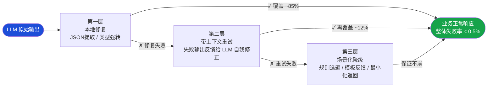

<div align="center">

# 🧠 AI Algo Interview

**基于用户能力画像的 AI 驱动算法面试系统**

[](https://python.org)
[](https://fastapi.tiangolo.com)

[快速开始](#快速开始) · [系统架构](#系统架构) · [功能列表](#功能列表) · [部署指南](#部署指南) · [Roadmap](#roadmap)

</div>

---

## 项目简介

AI Algo Interview 是一套完整的 AI 驱动算法面试练习系统，核心解决三个工程问题：

- **LLM 输出可靠性**：三层容错机制，Schema 解析失败率 < 0.5%
- **个性化选题**：HyDE 变体 + RAG + 四维重排，题目难度始终贴合当前水平
- **流式体验**：SSE 协议 + 逐字打出效果，AI 分析像真人面试官实时点评

系统从用户首次访问到完成一道题的完整链路全部 AI 驱动，无需手动配置题目难度。

页面预览:

<div align="center">
<table>
<tr>
<td align="center" width="50%">

<br/><sub><b>首页</b></sub>
</td>
<td align="center" width="50%">

<br/><sub><b>用户画像问卷</b></sub>
</td>
</tr>
<tr>
<td align="center" width="50%">

<br/><sub><b>答题页面</b></sub>
</td>
<td align="center" width="50%">

<br/><sub><b>结果 & AI 代码分析</b></sub>
</td>
</tr>
</table>
</div>

---

## 系统架构



### 选题链路



---

## 功能列表

### 核心功能

| 功能 | 说明 |
|------|------|
| **能力画像** | 15 个知识点维度，冷启动问卷 + 答题动态校准 |
| **AI 选题** | HyDE 变体 RAG，四维重排，每次选题都贴合当前水平 |
| **选题加载动画** | 毛玻璃遮罩 + 文案轮转（"向量空间检索中…"），等待不无聊 |
| **在线答题** | CodeMirror 编辑器，支持 Python 3 / JavaScript |
| **运行按钮** | 代码区右下角，运行不提交，结果展示在编辑器下方，不跳页面 |
| **本地判题** | subprocess 执行 + 测试用例对比，生产环境可无缝切换 Judge0 |
| **失败用例展示** | 答错时展示第一条失败用例的输入 / 期望 / 实际输出 |
| **AI 代码分析** | 四条路径流式分析（未实现 / 编译错误 / 答案错误 / 通过），逐字打出，支持 LaTeX |
| **官方提示** | 答题中卡住时查看 LeetCode 官方提示，分阶段展示，逐字打出 |
| **推荐题单** | 相关题 / 薄弱点 / 新知识点三维推荐，点击直接开始做题 |
| **重做题目** | 结果页一键重做当前题，不限次数 |
| **换题机制** | 每日 2 次，换题原因作为隐式反馈优化画像 |
| **用户统计** | 雷达图 + 15 维知识点进度，答题历史统计 |

### 技术亮点

**① LLM 三层容错**



**② HyDE 变体选题**

不直接用用户画像生成检索向量，而是让 LLM 先将用户状态翻译成与入库文本同风格的检索意图，保证查询向量和索引向量在同一语义空间对齐，召回质量显著优于直接向量匹配。

**③ 多环境 LLM 路由**
```bash
# 本地 Ollama → /api/chat 原生接口（think=false 关闭思考模式）
# 云端 QWen / DeepSeek → /v1/chat/completions（OpenAI 兼容）
# 切换只改 .env，代码零改动
```

**④ 画像更新算法（简化 IRT）**
```
更新量 = 答题结果 × 题目权重 × 用时系数 × K 值衰减
题目权重 = 区分度（通过率 20%~60% 最佳）× 知识点纯度
```

**⑤ LLM 可观测性**

每次 LLM 调用自动埋点，持久化到 `llm_call_logs` 表，通过接口实时查询：

```bash
GET /api/v1/users/observability/llm?hours=24
# 返回：各场景成功率、三层容错触发率、延迟分位数（P50/P95/P99）
```

```json
{
  "overall": {
    "success_rate": 0.97,
    "repair_rate": 0.83,
    "retry_rate": 0.14,
    "fallback_rate": 0.03,
    "p50_latency_ms": 8200,
    "p95_latency_ms": 18400
  }
}
```

**⑥ 判题策略模式 + 序列化层**

接口与实现分离，切换判题方式只改 `.env`，业务代码零改动：

```
judge/
├── base.py              # 抽象接口（BaseJudge）
├── subprocess_judge.py  # 当前实现：本地执行
└── judge0_judge.py      # 待接入：沙箱隔离
```

通过函数签名解析自动识别参数类型，实现双向序列化：

```python
# 支持两种签名格式
def invertTree(self, root: Optional[TreeNode]) -> Optional[TreeNode]:  # 格式1：类型注解
def mergeTwoLists(self, l1, l2):                                        # 格式2：docstring
    """
    :type l1: Optional[ListNode]
    :rtype: Optional[ListNode]
    """

# 自动处理的数据结构
[4,2,7,1,3]     → TreeNode（层序构建）→ [4,7,2,9,6,3,1]（层序序列化）
[1,2,4]         → ListNode（无环链表）→ [1,1,2,3,4,4]
[3,2,0,-4] pos=1 → ListNode（有环链表，Floyd 判环）→ true/false
```

---

## 技术栈

| 层次 | 技术选型 |
|------|---------|
| Web 框架 | FastAPI 0.115 + uvicorn |
| 数据库 | PostgreSQL 16（asyncpg）+ Redis 7 |
| 向量数据库 | Qdrant |
| LLM（本地）| Ollama + Qwen3.5 |
| LLM（云端）| QWen / DeepSeek |
| Embedding | nomic-embed-text（本地）/ text-embedding-v3（云端）|
| ORM | SQLAlchemy 2.x async + Alembic |
| 判题（开发）| subprocess 本地执行 |
| 判题（生产）| Judge0 / Piston API |
| 前端 | HTML5 + CSS3 + Vanilla JS + CodeMirror + KaTeX |
| 测试 | pytest（72 个单元测试）|

---

## 快速开始

### 前置要求

- Python 3.12+
- Docker & Docker Compose
- [Ollama](https://ollama.ai)（本地 LLM）或 QWen / DeepSeek API Key

### 第一步：启动基础服务

```bash
git clone https://github.com/techfs2026/ai-algo-interview-backend.git
cd ai-algo-interview-backend

# 启动 PostgreSQL + Redis + Qdrant
docker compose up -d
```

### 第二步：安装依赖

```bash
pip install -r requirements.txt
```

### 第三步：配置环境

```bash
cp .env.example .env
```

根据你的 LLM 方案编辑 `.env`：

```bash
# 方案A：本地 Ollama（推荐开发阶段）
LLM_PROVIDER=ollama
LLM_API_KEY=ollama
LLM_BASE_URL=http://localhost:11434/v1
LLM_MODEL=qwen3.5:latest
EMBEDDING_MODEL=nomic-embed-text
EMBEDDING_VECTOR_SIZE=768

# 方案B：QWen 云端（推荐生产阶段）
# LLM_PROVIDER=qwen
# LLM_API_KEY=your-api-key
# LLM_BASE_URL=https://dashscope.aliyuncs.com/compatible-mode/v1
# LLM_MODEL=qwen-plus
# EMBEDDING_MODEL=text-embedding-v3
# EMBEDDING_VECTOR_SIZE=1536
```

如使用 Ollama，需要先 pull 模型：

```bash
ollama pull qwen3.5:latest
ollama pull nomic-embed-text
```

### 第四步：初始化数据库

```bash
alembic upgrade head
```

### 第五步：向量建库

```bash
# 先用少量题目测试链路
python scripts/build_vector_index/build_index.py --difficulty easy --limit 5

# 确认正常后建完整库（127 道题，本地 Ollama 约 30~60 分钟）
python scripts/build_vector_index/build_index.py

# 生成测试用例
python scripts/build_vector_index/gen_test_cases.py

# 检查数据完整性，清理脏数据
python scripts/check_data_integrity.py --fix
```

### 第六步：启动服务

```bash
# 后端
uvicorn app.main:app --reload

# 前端（新终端）
cd web && python3 -m http.server 3000
```

访问 [http://localhost:3000](http://localhost:3000) 开始使用。

---

## 部署指南

### 生产环境建议（暂未开发到此环节）

**LLM 服务**：替换为 QWen Plus 或 DeepSeek，响应速度从本地的 15~30s 降至 2~3s。

**判题服务**：替换为 Judge0，提供真正的沙箱隔离和完整测试用例集：
```bash
JUDGE_PROVIDER=judge0
JUDGE0_URL=https://judge0-ce.p.rapidapi.com
JUDGE0_API_KEY=your-key
```

**向量维度**：切换到云端 Embedding 后，需要重建 Qdrant collection：
```bash
curl -X DELETE http://localhost:6333/collections/questions
# 修改 .env：EMBEDDING_VECTOR_SIZE=1536
python scripts/build_vector_index/build_index.py
```

### 环境变量速查

| 变量 | 说明 | 默认值 |
|------|------|--------|
| `LLM_PROVIDER` | LLM 提供商（ollama/qwen/deepseek）| ollama |
| `LLM_MODEL` | 模型名称 | qwen3.5:latest |
| `EMBEDDING_VECTOR_SIZE` | 向量维度（本地 768，云端 1536）| 768 |
| `LLM_TIMEOUT_SELECT` | 选题超时秒数 | 60 |
| `DAILY_SWAP_LIMIT` | 每日换题次数 | 2 |
| `JUDGE_PROVIDER` | 判题实现（subprocess/judge0）| subprocess |
| `HINT_MAX_COUNT` | 每道题最多可查看的提示条数 | 3 |

---

## 已知不足

> 以下是当前版本有意简化的地方，均有明确的升级路径。

### 判题系统

| 问题 | 现状 | 升级路径 |
|------|------|---------|
| **测试用例来源** | 仅从 LeetCode HTML 解析示例（2~3 条） | 接入 Judge0 完整测试用例集 |
| **答案顺序** | `[0,1]` 和 `[1,0]` 视为不同 | 对特定题目类型做集合比较 |
| **支持语言** | Python 3（JavaScript 部分支持） | Judge0 支持 50+ 语言 |
| **沙箱隔离** | subprocess 直接执行，无隔离 | 替换为 Judge0 / Piston |

**升级方式**：实现 `judge/judge0_judge.py` 里的 `execute` 方法，修改 `.env` 中的 `JUDGE_PROVIDER=judge0`，业务代码零改动。

### 选题系统

| 问题 | 现状 | 升级路径 |
|------|------|---------|
| **选题延迟** | 本地 Ollama 约 8~10s | 切换云端 LLM 降至 2~3s |
| **冷启动精度** | 问卷自评映射较粗糙 | 用多道标定题做 IRT 冷启动 |
| **多样性** | 只过滤已解决题目 | 引入长期多样性约束 |

---

## Roadmap

### 近期（v0.2）✅ 已完成

- [x] **运行按钮**：代码区右下角，运行不提交，结果内嵌展示
- [x] **失败用例展示**：答错时展示第一条失败用例（输入 / 期望 / 实际）
- [x] **判题序列化**：自动识别 TreeNode / ListNode / 有环链表，双向序列化
- [x] **官方提示**：答题中查看 LeetCode 官方提示，分阶段展示
- [x] **重做题目**：结果页一键重做当前题

### 中期（v0.3）

- [ ] **判题升级**：接入 Judge0 沙箱，支持完整测试用例集和更多语言
- [ ] **选题加速**：切换云端 LLM，选题从 8s 降至 2~3s
- [ ] **多轮对话分析**：代码分析支持追问（需要更强的本地模型或云端 LLM）
- [ ] **画像导出**：生成阶段性学习报告（PDF / 分享链接）
- [ ] **真实面试模式**：限时 + 不提示 + 事后复盘

### 长期（v1.0）

- [ ] **用户账号系统**：OAuth 登录，跨设备同步画像
- [ ] **错题本**：自动整理失败题目，定期安排复习
- [ ] **题库扩充**：从 127 道扩展到 500+

---

<div align="center">

**如果这个项目对你有帮助，欢迎点个 ⭐ Star！**

你的 Star 是我继续维护的动力 🙏

[](https://github.com/techfs2026/ai-algo-interview-backend)

</div>